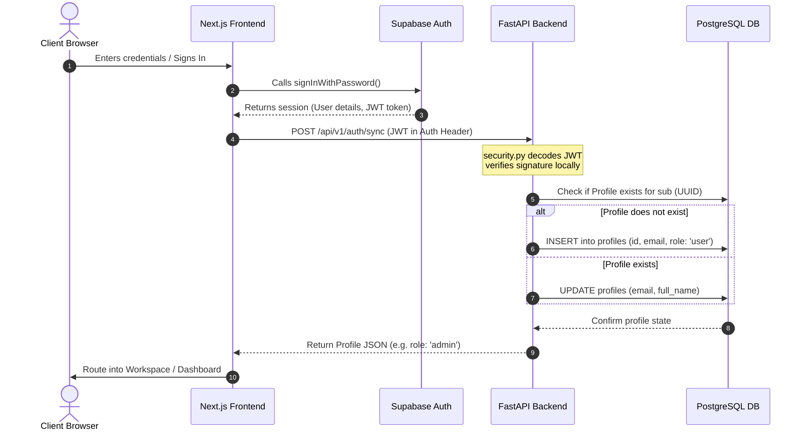
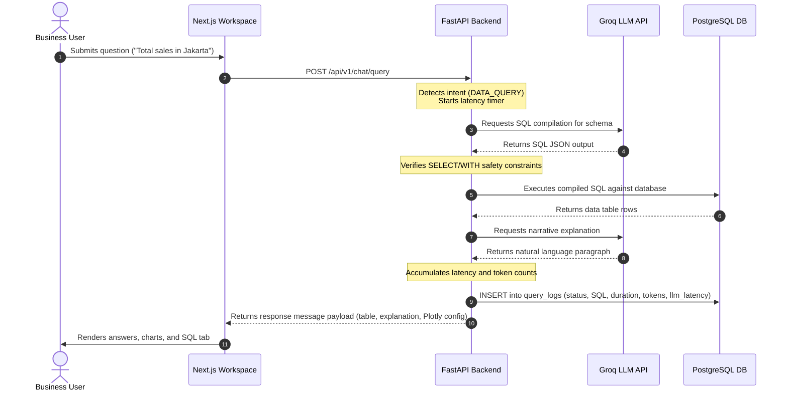

# Conda AI — Conversational Data Analyst

Conda AI is a production-ready, self-service enterprise analytics portal built on a Next.js frontend and a FastAPI backend. It allows non-technical business teams to query their PostgreSQL database in plain language, automatically compile SQL, execute queries securely, render visualizations, summarize findings, and ingest documents.

The system is deployed using `openai/gpt-oss-120b` via the Groq API cloud service (or falls back to mock sandbox engines for local offline development).

---

## 🌟 Project Highlights & Core Features

*   **Read-Only SQL Agent**: Schema-aware text-to-SQL compiler that automatically detects join relationships, groupings, and filters, while strictly blocking modifying statements (`INSERT`, `UPDATE`, `DELETE`, etc.) via two-stage regex safety filters.
*   **Contextual Multi-Turn Conversation**: Supports slot-filling, follow-up query editing, and multi-turn clarifying questions (disambiguates questions like *"revenue from completed orders"* before compiling SQL).
*   **Automatic Visualization & Insights**: Recommends appropriate Plotly.js charts based on output schemas, displaying tabular grids alongside plain-language business explanations.
*   **Audit Logging & Transparency**: Persists audit logs of query statements, database executions, LLM token usages, and timing metrics, complete with an interactive admin **Log Viewer** and PDF/CSV exporter.
*   **Evaluation Performance Matrix Dashboard**:
    *   **KPI Scorecard Grid**: Live monitors overall Execution Accuracy %, SQL Syntax Success Rate %, Average Latency (s), and Token Consumption Cost.
    *   **Interactive Trend Visualizers**: Renders latency trends over time and query outcome distribution donut charts dynamically utilizing the project's custom theme-based Plotly.js layout recoloring.
    *   **20-Question Golden Test Suite**: An interactive test runner that executes 15 analytical database queries and 5 out-of-scope validation prompts to calculate real-time compiler accuracy drift.
*   **Document Ingestion**: Extracts tabular data layouts from uploaded PDFs/CSVs to seed database structures.

---

## 🏗️ System Architecture & Database Schema

The backend uses SQLAlchemy ORM to manage **14 database tables** partitioned into sales context data and system operational records. 

### Database Schema (ERD Overview)
A full entity relationship model is documented at [docs/erd.md](file:///c:/Code/conda-ai/IT-Project/docs/erd.md).
*   **Core Business Tables**: `customers`, `products`, `orders`, `payments`, and `order_items`.
*   **Application System Tables**: `profiles` (linked to Supabase user UUIDs), `conversations`, `messages`, `query_logs` (storing LLM latency/tokens), `benchmark_results`, `feedback`, `uploaded_documents`, `extracted_tables`, and `document_chunks`.

### Core System Flows
Complete system interaction sequence diagrams are documented at [docs/sequence_diagrams.md](file:///c:/Code/conda-ai/IT-Project/docs/sequence_diagrams.md).

#### 1. Authentication & Profile Sync Flow


#### 2. Chat Processing & Metrics Logging Flow


---

## 📁 Directory Structure Mapping

```
conversational-data-analyst/
├── backend/
│   ├── app/
│   │   ├── api/             # HTTP Route schemas, V1 admin controllers, and endpoint routers
│   │   ├── application/     # Core services: NL-to-SQL compiler, PDF/CSV parser, benchmarks
│   │   ├── core/            # Database engine, JWT verification, seeder configs
│   │   ├── domain/          # Database ORM models (QueryLog table updates)
│   │   └── infrastructure/  # Repositories (Profiles, Messages, QueryLogs)
│   ├── alembic/             # DB schema migration configurations
│   ├── Dockerfile
│   └── requirements.txt
├── frontend/
│   ├── src/
│   │   ├── app/             # Next.js pages (landing, login, workspace, admin panel)
│   │   ├── components/      # UI components (theme toggles, custom cards, tables)
│   │   │   ├── admin/       # EvaluationMatrix dashboard, LogViewer, BenchmarkRunner
│   │   │   └── chat/        # Message bubble, QueryVisualizer Plotly container
│   │   ├── services/        # ApiService fetch configurations
│   │   ├── store/           # Zustand global state (Auth status)
│   │   └── types/           # TypeScript interfaces and contracts
│   ├── Dockerfile
│   └── package.json
├── docs/
│   ├── erd.md               # Detailed database Entity-Relationship documentation
│   ├── sequence_diagrams.md # Runtime message flow visualization
│   ├── business_case.md     # democratized self-service business case and ROI analysis
│   └── HOW-TO-RUN.md        # Comprehensive local running guide
└── docker-compose.yml       # Monorepo container stack orchestrations
```

---

## 🚀 Getting Started & Local Running

For a complete step-by-step developer environment setup, refer to [docs/HOW-TO-RUN.md](file:///c:/Code/conda-ai/IT-Project/docs/HOW-TO-RUN.md).

### Quickstart (TL;DR)

1.  **Configure Backend `.env`**:
    Inside the `backend/` folder, create `.env` containing:
    ```env
    DATABASE_URL=postgresql+asyncpg://postgres.<ref>:<password>@aws-1-<region>.pooler.supabase.com:5432/postgres
    DATABASE_SYNC_URL=postgresql://postgres.<ref>:<password>@aws-1-<region>.pooler.supabase.com:5432/postgres
    GROQ_API_KEY=your_groq_api_key_here
    SUPABASE_URL=https://<your-project>.supabase.co
    SUPABASE_ANON_KEY=<your-anon-key>
    SUPABASE_JWT_SECRET=<your-jwt-secret>
    ENVIRONMENT=development
    SQL_GENERATION_MODEL=openai/gpt-oss-120b
    EXPLANATION_MODEL=openai/gpt-oss-120b
    ```

    > [!TIP]
    > If `GROQ_API_KEY` is set to `mock-groq-key` or left as empty, Conda AI automatically initiates **Mock Sandbox Engine mode**. This mock environment allows full offline navigation, chat simulations, and dashboard reviews without calling external API keys!

2.  **Boot the Services**:
    Open two terminals and execute:

    *   **Terminal 1 — Backend**:
        ```bash
        cd backend
        python -m venv .venv
        source .venv/bin/activate # macOS/Linux or .\.venv\Scripts\activate on Windows
        pip install -r requirements.txt
        python -m uvicorn app.main:app --host 127.0.0.1 --port 8000
        ```

    *   **Terminal 2 — Frontend**:
        ```bash
        cd frontend
        npm install
        npm run dev
        ```

3.  **Explore the App**:
    *   Open `http://localhost:3000`.
    *   Click **Admin Sandbox** shortcut to log in immediately as `admin@cda.com` with role-based policies.
    *   Go to **Admin Panel** in the top-right corner to access the **Evaluation Matrix** dashboard tab.

---

## 📈 Evaluation & Diagnostics

### 1. Logs Audit & Export
The system logs every query. Administrators can audit these in **Admin Panel → Execution Logs**, and export the data as a formatted **CSV** or **PDF report** via server-side generation.

### 2. Golden Dataset Benchmarking
Administrators can run the Text-to-SQL compiler benchmark in the **Diagnostics** tab or test it via HTTP:
```bash
curl -X POST http://localhost:8000/api/v1/admin/benchmarks/run?sample=10
```

### 3. Real-Time Model Performance & Test Suite
The newly implemented **Evaluation Matrix** tab in the Admin dashboard queries database aggregations to compute real-time compiler accuracy and displays:
*   **Average Latency trends** and **Query Outcome distributions** plotted using custom Plotly.js layouts.
*   **Golden Test Suite runner**: Hits `/api/v1/admin/evaluation/test-suite` running a 20-prompt validation test suite (including out-of-scope prompts) to verify intent detection, safety blockers, and execution data matching.

---

## 📄 Business Case & ROI Value

 Democratizing data access within the company offers quantifiable ROI:
*   **Analyst Overhead Reduction**: Reclaims up to 3+ hours per analyst daily by shifting repetitive ad-hoc data pulls to read-only automated self-service query.
*   **Accelerated Decision Making**: Decoupled database reporting turns multi-day analytics ticket waiting times into a 5-second plain-text visual response.

Read the complete business analysis and pricing models at [docs/business_case.md](file:///c:/Code/conda-ai/IT-Project/docs/business_case.md).
