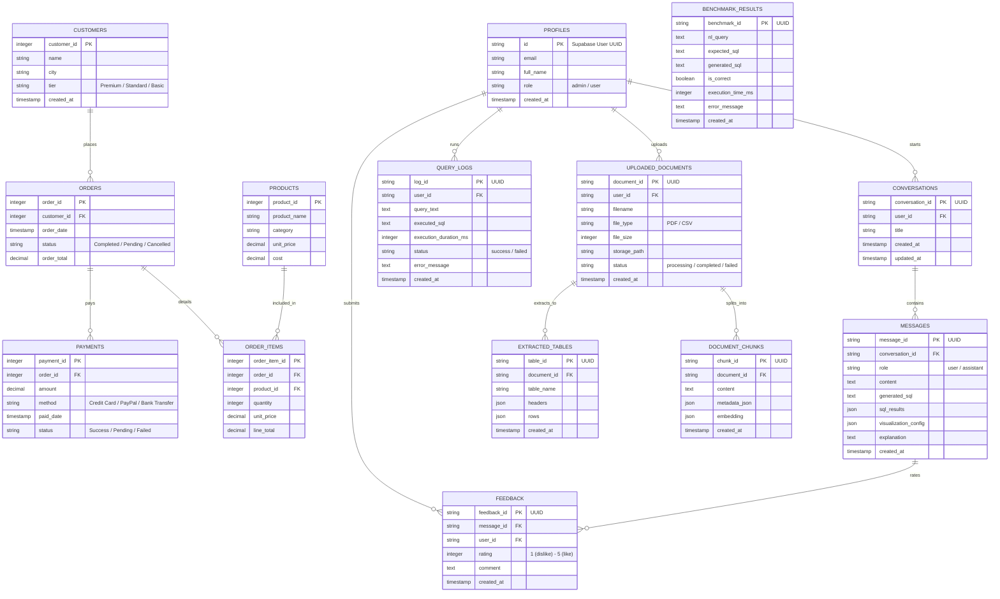

# Entity-Relationship Diagram (ERD)

The database schema of the **Conversational Data Analyst** project consists of **14 tables** divided into **Core Business tables** (containing seedable sales data) and **Application operational tables**.

