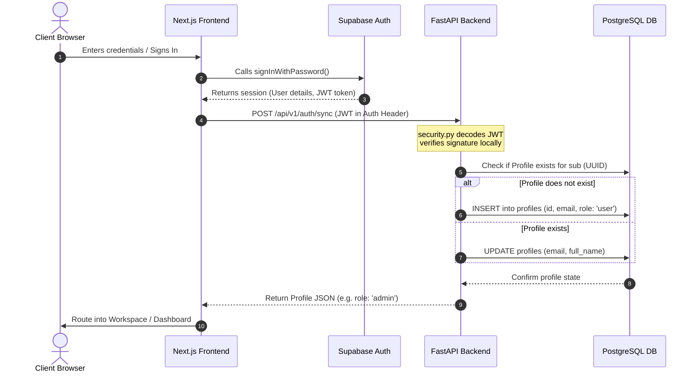
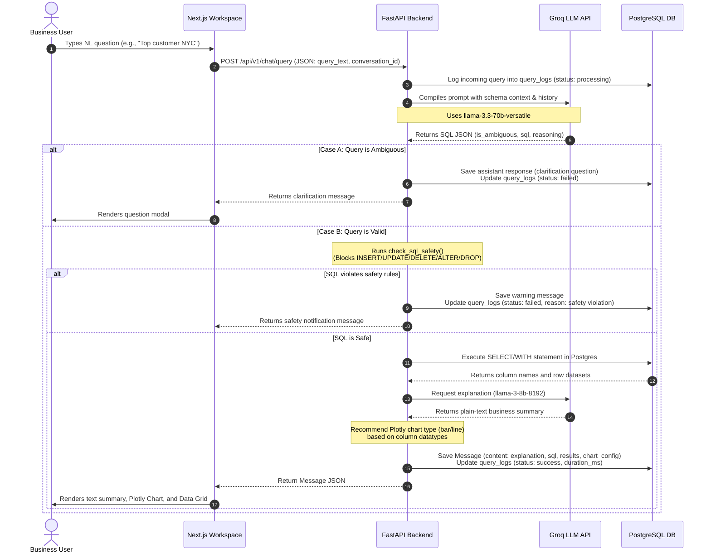
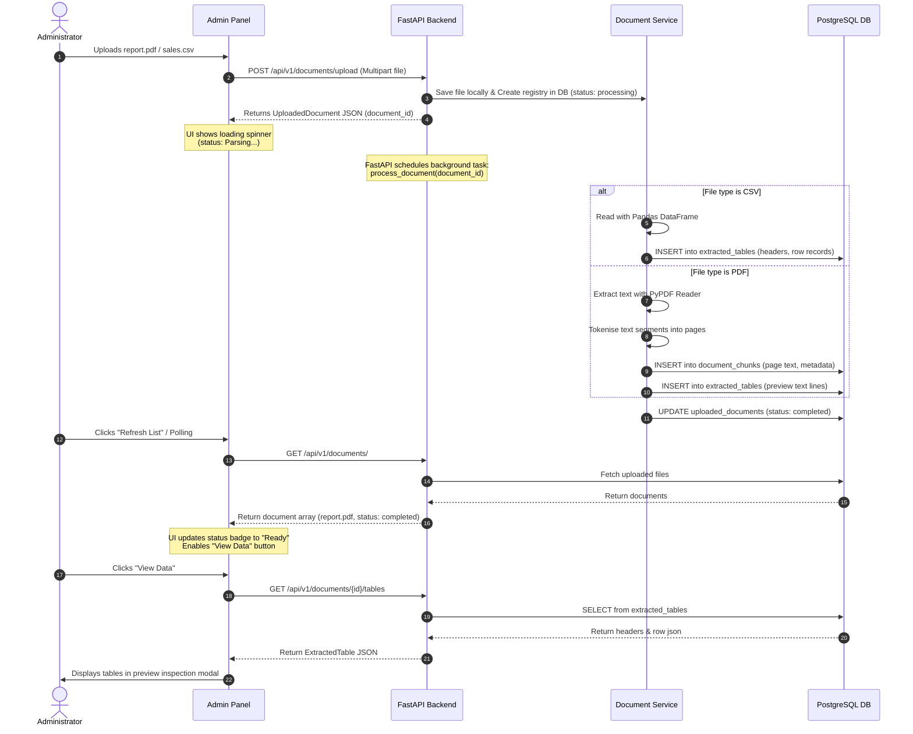

# System Sequence Diagrams

These sequence diagrams illustrate the runtime interaction flows between the Next.js Frontend, the FastAPI Backend, Supabase Auth, the PostgreSQL Database, and the Groq LLM API.

---

## 1. User Authentication & Profile Synchronization

This flow shows how user details are synchronized to our PostgreSQL database right after client sign-up/login.

---

## 2. Conversational Analyst Execution Loop

This diagram models the core natural language processing, safety guardrails verification, SQL compilation, execution, and UI presentation loop.

---

## 3. Document Intelligence Parser Flow

This flow illustrates the asynchronous file processing pipeline for CSVs and PDFs.

